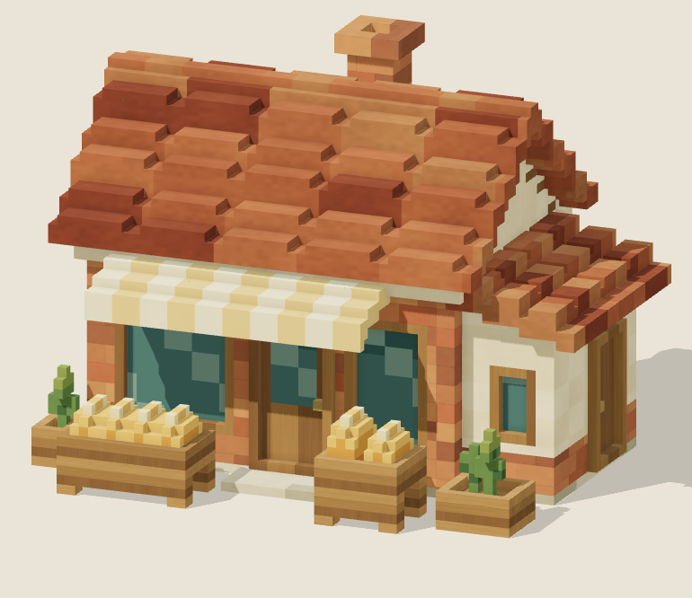
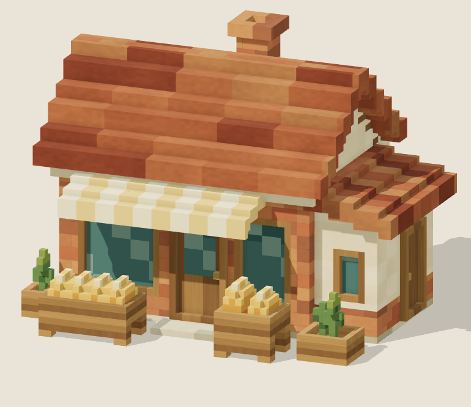

# 屋根の溝の修正 — 2026-09-24

ユーザー指摘：屋根の一列が隙間になって見える。

初版は瓦の幅9セルのうち2セルを1段低くしており、15cmの深さ・30cmの幅の溝になっていた。また、棟直下の前側1列にも上面の追加漏れがあった。下地は閉じていたが、穴がないという構造検査だけではこの見え方を捉えられていなかった。

## 修正

- 本屋根の全幅に上面セルを連続させ、低い列と棟直下のくぼみを埋めた。
- 同じ問題があった増築の屋根も、段ごとに上面をつないだ。本体の妻壁・軒との接続位置は既存のセルを保つ。
- 瓦の5列の色のまとまり、勾配の段差、15cmセル、材質と照明は維持した。
- `model.mjs` の `optimization` / `roof-seams` に適用。既存の各工程の比較画像は初版の記録として保持する。

## 確認

- 接地・開口・入口・煙突・支持・屋根全体を検査。新たに、各段の上面全幅と棟直下の連続性を全セルで検査した。
- 実ブラウザーの描画面を正本セルと全数照合：19,712面、向き・面積・位置が一致。
- 保存復元・分解部品・階層の3件を確認。ブラウザーのエラーなし。
- 参照視点・右・裏を目視確認。くぼんだ列がなくなり、色のまとまりと横方向の段差が残る。元画像より規則的で角張った屋根という近似上の差は残る。
- 17,865セル / 15,666三角形 / 27部品。セルは508増えたが溝の側面がなくなり、三角形は1,780減った。iPhone実機性能は未測定。

これはユーザー指摘に対する局所修正と検証の記録。初版の全工程の審査を再実行したという意味ではない。
