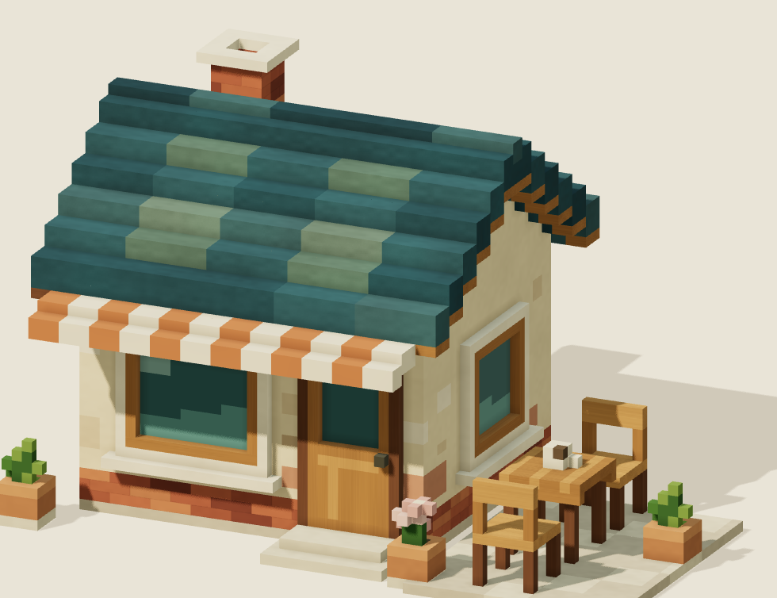

# 屋根の構成・全体の配色と明暗

## 現行：パン屋に合わせた粒度 / 2026-09-24・roof14

ユーザーの指定により、瓦幅4セル・10列から8セル・5列へ変更した。編集単位は15cm角のまま。列ごとのずれと段頭の低い1列をなくし、全幅で上面を連続させる。棟の色分けも8セルに合わせ、材質の旧60cm目地は新屋根に適用しない。青緑の基調と緑灰色のまとまり、素材の微細な質感、壁・家具・庇・煙突と照明は維持する。

14,335セル・10,270三角形・22部材。roof13より三角形は2,748少ない。全セル接地、全列の支持・上面、隣接列と段の接続、煙突の穴、入口、屋根以外のセル不変、整数セルと描画境界の一致を確認した。実ブラウザーの参照視点・側面・裏面等の画像を `evidence/roof14-*.png` に保存し、シェーダーエラーなし。iPhone性能は未測定。

視覚的な粒度を揃える局所修正であり、参照画像の細かな目地・面取りの再現を優先したものではない。正式な品質ゲートの保留状態は変更しない。以前の記録は以下に保持する。

## 以前の構成 / 2026-09-23・roof13

対象は個別カフェ。ユーザーが承認した15cm角・面取りなしを維持し、採用全景の実切り出しを参照して屋根を組み直した。旧モデルは変更せず `roof-design.mjs` で別のセル集合を作る。標準表示はroof13の「屋根＋色と明暗」。

## 屋根

以前の瓦は各列の段差が同じ位置で揃い、横長の帯に見えていた。瓦幅4セル・10列を維持し、列の開始位置を0または1セルずらした。最終の並びは `[0,0,1,1,0,0,0,1,1,0]`。緑灰色の瓦のまとまりと段差の位置を合わせ、細かな交互模様を抑えた。棟と外周の大きさは維持。

初回roof11ではずらす列が細かく、側面のくぼみが強く読めた。roof12で下地を黒に近い共通色から各瓦に対応する色に変更し、roof13でずらす列をまとめた。段差による陰影は残るが、実際の穴や空の溝は設けていない。瓦の下には3セル分の支持層があり、隣の列・隣の段と高さ方向で重なる。

セルの形・寸法はすべて同一。頂点の歪み、端数サイズ、面取りは追加していない。瓦の並びとセル色を変更したため、新しい屋根の表面形状は以前と異なる。屋根以外の壁・窓・庇・家具・煙突のセルは以前と完全一致。

## 色と明暗

専用パレット `DESIGN_PALETTE` を追加。屋根の基調を `#30575e` の深い青緑へ、壁を `#ead6aa` の暖かい漆喰色へ調整。木部は黄みを整理し、煉瓦の暗色とガラスの明暗も調整した。ガラスの透明化は行っていない。

昼光は主光3.15・半球光0.84・補助光0.23、環境反射強度0.30。接点の陰影は0.135。建物全体の配色と合わせ、屋根、壁、軒下、窓の奥を読み分けやすくした。旧表示は元の照明・配色を保持。

## 比較・確認

- 「前の版」：material10の形・配色・素材・照明。保存画像のSHA-256一致を確認し、過去版を上書きしていない。
- 「屋根のみ」：新しい瓦の配置とセル色、以前のパレット・照明。
- 「屋根＋色と明暗」：新しい屋根、専用パレットと照明。

`evidence/roof13-material.png` / roof / designが同じカメラの3段階。match/front/right/back/leftとneutral/grazingを保存。small-material/roof/designは294×226ピクセルで実際に描画した比較。「仕上げ比較」から再生成できる。reference-comparisonは正本の切り出しとの比較、before-afterは変更前後。

目視では横一列の段が分かれ、瓦のまとまりと濃い屋根・暖かい壁の差が小さな表示でも読めるようになった。参照の細かな面取り・歪み・ガラスの反射模様までは一致していない。真横では段のくぼみの陰影が強く出るため、回転中の見え方は今後のユーザー確認対象。

`check-roof-design.mjs` は全1,440列の閉じた支持層、横と奥行き両方向の接合、全セルの接地連結、屋根以外のセル不変、煙突の開口、入口、材質属性、描画面と占有境界の完全一致を検査。`check-material-study.mjs` の従来素材検査も通過。ブラウザーでシェーダーエラーなし、分解・視点・照明・仕上げの切り替えを確認。

最終版：13,856セル、13,018三角形、22部材メッシュ。前の版は13,945セル・11,258三角形。セル数は89減ったが、段の露出面が増え、三角形数は約15.6%増えた。iPhoneの性能は未測定。

保存形式version 7は実際のセルと選択中のパレット、`staggered-grid-v1` の屋根指定、各瓦の列のずれを保存する。本体・他地区への統合は未実施。正式な品質ゲートと評価点は変更していない。
